# Backend Architecture - Find That Book

This document illustrates the Clean Architecture implementation of the **FindThatBook.Api** backend.

## Class Diagram

```mermaid
classDiagram
    %% 1. DOMAIN LAYER: The Core (No dependencies)
    namespace Domain {
        class SearchIntent {
            +string? Title
            +string? Author
            +string? ExtractedTitleFragment
            +string? ExtractedAuthorFragment
            +List~string~ Keywords
            +IntentExplainer? Explanation
        }
        class BookCandidate {
            +string Title
            +List~string~ Authors
            +MatchRank Rank
            +string Explanation
        }
        class MatchResult {
            +MatchRank Rank
            +MatchType MatchType
        }
    }

    %% 2. APPLICATION LAYER: Business Rules & Orchestration (Depends on Domain)
    namespace Application {
        class IBookSearchService {
            <<interface>>
            +SearchAsync(query)
        }
        class IAiService {
            <<interface>>
            +ExtractSearchIntentAsync(query)
            +RankAndExplainResultsAsync(candidates)
        }
        class IOpenLibraryClient {
            <<interface>>
            +SearchBooksAsync(intent)
            +GetPrimaryAuthorsAsync(workId)
        }
        class IBookMatcher {
            <<interface>>
            +CalculateMatch(query, intent, candidate)
        }

        class BookSearchService {
            -IAiService _aiService
            -IOpenLibraryClient _client
            -IBookMatcher _matcher
            +SearchAsync(query)
        }
        class BookMatcher {
            +CalculateMatch(query, intent, candidate)
        }
    }

    %% 3. INFRASTRUCTURE LAYER: External Concerns (Depends on Application & Domain)
    namespace Infrastructure {
        class GeminiAiService {
            -IChatClient _chatClient
        }
        class OpenLibraryClient {
            -HttpClient _httpClient
        }
    }

    %% 4. PRESENTATION LAYER: Entry Point (Depends on Application)
    namespace Presentation {
        class SearchController {
            -IBookSearchService _service
            +Search(query)
        }
    }

    %% RELATIONSHIPS & DEPENDENCY FLOW

    %% Presentation depends on Application Interface
    SearchController --> IBookSearchService : Uses

    %% Application Services implement Application Interfaces
    BookSearchService ..|> IBookSearchService : Implements
    BookMatcher ..|> IBookMatcher : Implements

    %% Application Service depends on Interfaces (Dependency Inversion)
    BookSearchService --> IAiService : Uses
    BookSearchService --> IOpenLibraryClient : Uses
    BookSearchService --> IBookMatcher : Uses

    %% Infrastructure implements Application Interfaces
    GeminiAiService ..|> IAiService : Implements
    OpenLibraryClient ..|> IOpenLibraryClient : Implements

    %% Domain Usage (Implicitly used by all, explicitly shown for key flows)
    BookSearchService ..> SearchIntent : Creates/Flows
    BookSearchService ..> BookCandidate : Flows
    GeminiAiService ..> SearchIntent : Returns
```

### Architecture Analysis

*   **Dependency Rule (Inward Flow):**
    *   **Domain** is at the center and depends on nothing.
    *   **Application** depends only on **Domain**.
    *   **Infrastructure** and **Presentation** depend on **Application**. Notice how `GeminiAiService` (Infrastructure) implements `IAiService` (defined in Application). This is the key **Dependency Inversion** principle that decouples business logic from specific providers.
*   **Separation of Concerns:**
    *   **Domain:** Holds data structures (`SearchIntent`, `BookCandidate`).
    *   **Application:** Orchestrates the search flow (`BookSearchService`) and defines rules for matching (`BookMatcher`).
    *   **Infrastructure:** Handles calling external APIs (Google Gemini, OpenLibrary).
*   **Monolithic Structure:**
    *   While logically separated into strict layers, they reside in the same project (`FindThatBook.Api`), making it a **Modular Monolith**. This provides the benefits of clean architecture without the complexity of microservices.
